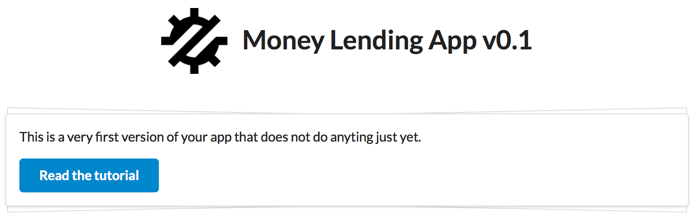
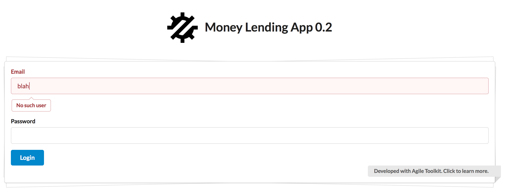
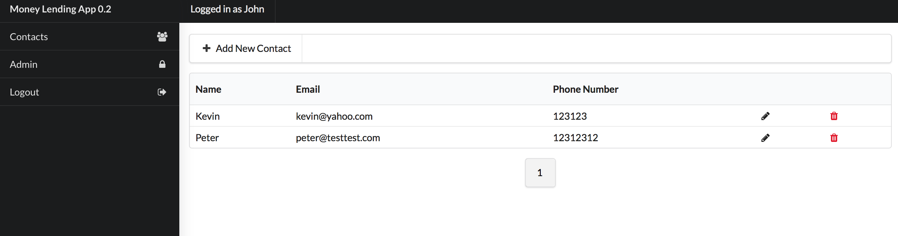

# Money Lending App Tutorial - Step 1

**If you are new to Agile Toolkit, read http://www.agiletoolkit.org/intro first**.

Assuming that you have already cloned this application and running on your local server, you should see in your browser:



That means that Agile Toolkit is installed and your PHP works perfectly. You'll also need need MySQL for this tutorial, so you should probably start downloading it.

## Creating File structure

Our project will be multi-file application. I'll be creating files such as `admin.php`, `index.php`, `contact.php` and but to avoid code duplication I'll also create  file  `lib.php`, where I'll be putting all of my objects. If you prefer to use PSR class loader or URL routing, you should be able to figure it out yourself.

The first class I'll add into `lib.php` will be MyApp. Extending from the standard App, I'll add some properties and methods which are specific to my money lending application. This is what your  `lib.php` should contain (see below for clarifications):

``` php
<?php
require'vendor/autoload.php';
session_start();

class MyApp extends \atk4\ui\App {
    public $title = 'Money Lending App 0.2';
    public $db;
    public $user;

    function __construct() {
        parent::__construct();

        
        $this->db = new \atk4\data\Persistence_SQL(
         'mysql:host=127.0.0.1;dbname=money_lending', 
         'root', 
         'root'
        );
       
        $this->initLayout('Admin');

        $this->layout->leftMenu->addItem(['Contacts', 'icon'=>'users'], 'contact.php');
        $this->layout->leftMenu->addItem(['Admin', 'icon'=>'lock'], 'admin.php');
    }
}
```

At the top - always include autoloader and since we will want to use log-in, we should start the session.

MyApp class contains several properties - $title is the name of my application. The $db and $user properties will be used to hold my MySQL database persistence object and the model of a currently-logged-in user.

Create file `admin.php` with just this lines:

``` php
<?php
require'lib.php';
$app = new MyApp();
```

Opening it up in your browser, yous hould see the application layout like this:


## Setting up the Database

We are buliding a multi-user application, so you'll need a table for storing user accounts. Each account has many contacts and each contact has many loans. Here is how my database schema looks like:


Here I include SQL dump, which you can import into MySQL:

```sql
CREATE TABLE IF NOT EXISTS `user` (
  `id` INT NOT NULL AUTO_INCREMENT,
  `email` VARCHAR(255) NULL,
  `password` VARCHAR(255) NULL,
  `name` VARCHAR(255) NULL,
  `surname` VARCHAR(255) NULL,
  PRIMARY KEY (`id`))
ENGINE = InnoDB;

CREATE TABLE IF NOT EXISTS `contact` (
  `id` INT NOT NULL AUTO_INCREMENT,
  `name` VARCHAR(255) NULL,
  `email` VARCHAR(255) NULL,
  `phone_number` VARCHAR(255) NULL,
  `user_id` INT NOT NULL,
  PRIMARY KEY (`id`),
  INDEX `fk_contact_user1_idx` (`user_id` ASC),
  CONSTRAINT `fk_contact_user1`
    FOREIGN KEY (`user_id`)
    REFERENCES `user` (`id`)
    ON DELETE CASCADE
    ON UPDATE NO ACTION)
ENGINE = InnoDB;

CREATE TABLE IF NOT EXISTS `loan` (
  `id` INT NOT NULL AUTO_INCREMENT,
  `contact_id` INT NOT NULL,
  `amount` DECIMAL(8,2) NOT NULL,
  `due` DATE NOT NULL,
  `repaid` DECIMAL(8,2) NOT NULL,
  `is_active` TINYINT(1) NOT NULL,
  PRIMARY KEY (`id`),
  INDEX `fk_loan_contact1_idx` (`contact_id` ASC),
  CONSTRAINT `fk_loan_contact1`
    FOREIGN KEY (`contact_id`)
    REFERENCES `contact` (`id`)
    ON DELETE CASCADE
    ON UPDATE NO ACTION)
ENGINE = InnoDB;
```

Additionally you need to define Model classes. I'll just start with the User class. Add the following code into `lib.php` file:

``` php
class User extends \atk4\data\Model {
    public $table = 'user';

    function init()
    {
        parent::init();

        $this->addFields([
            'email',
            ['password', 'type'=>'password'],
            'name',
            'surname'
        ]);
    }
}
```

We simply describing the fields and their types of a Model. Finally add the following line to your `admin.php` file:

``` php
$app->layout->add('CRUD')->setModel(new User($app->db));
```

 Refresh the `admin.php` page and it will have a fully functional CRUD element where you can add a few users:


Be sure to remember what password you have used.

## Setting up Log-in screen

To make a nicely looking log-in the 'Centered' layout would be most suitable. However, `MyApp` already initializes 'Admin', so I'm going to add an argument to the constructor of MyApp class to bypass the authentication:

``` php
    function __construct($authenticate = true) {
    //                   ^^^^^^^^^^^^^^^^^^^^
```

Then the body of constructor should have this code:

``` php
        if (!$authenticate) {
            $this->initLayout('Centered');
            return;
        }

        $this->initLayout('Admin');
```

You should be able to understand this code intuitively. Next open your `index.php` and and modify it so it would initialise `MyApp` instead of using `App`. You also no longer need `initLayout`. You should also replace `require` line to include `lib.php`. Your `index.php` now should look like this:

``` php
<?php
require'lib.php';

$app = new MyApp(false);

// further code goes here

$app->layout->add([
  'Label', 
  'Developed with Agile Toolkit. Click to learn more.',
  'right ribbon gray'
])->link('https://github.com/atk4/money-lending-tutorial');
```

Now lets create a Form with email/passord fields:

``` php
$form = $app->layout->add('Form');
$form->addField('email');
$form->addField('password');

$form->buttonSave->set('Login');
```

I added an extra line that changes the label of the default 'Save' button to 'Login'. Next you need to add form submit callback which will check if email/password correspond to any user:

``` php
$form->onSubmit(function($form) { 

    $m = new User($form->app->db);
    $m->tryLoadBy('email', $form->model['email']);

    if (!$m->loaded()) { 
        return $form->error('email', 'No such user');
    }

    return 'OK for now';
});
```

The `onSubmit` method will be called on form submission and because closures in PHP by default can't access any variables defined outside, it passes the $form into the callback.

Agile Toolkit automatically sets the `app` property of all the objects to point to `MyApp`, which makes it very easy for me to access the $db property. Creating new object User will not perform any loading just yet, so teh next line will attempt to find user with a specified email. Even though I didn't specify any `Model` to the form just yet, it will create an anonymous model and populate fields. In 95% of use-cases you would want to use Form with `setModel`.

Form's method `error` returns Action for displaying error on a form just below a specified field and containing specified text. I can either return a single error or array of multiple errors:



Next, lets make sure the password is verified correctly:

``` php
    if ($m['password'] != $form->model['password']) {
        return $form->error('password', 'Incorrect password');
    }
```

If everything was successful we should probably store 'user_id' inside session:

``` php
    $_SESSION['user_id'] = $m->id;
```

And finally, instead of returning string and showing alert, lets return a custom expression which will redirect us to a different page. It contains a very simple snippet of JavaScript code:

``` php
    return new \atk4\ui\jsExpression('document.location=[]', ['contact.php']);
```

In here I have used `[]` to reference first argument to an expression. That's a preferred way to pass any variables into your JavaScript snippets. Values passed through arguments will be automatically JSON-encoded, so you don't have to worry about JavaScript injections.

## Showing list of Contacts

First we need to define model for a Contact:

``` php
class Contact extends \atk4\data\Model {
    public $table = 'contact';

    function init()
    {
        parent::init();

        $this->addFields([
            'name','email','phone_number'
        ]);
    }
}
```

Since models `Contact` and `User` are related, lets link them with `hasOne` and `hasMany`.

``` php
		// into Contact::init() add:
        $this->hasOne('user_id', new User());

		// into User::init() add:
        $this->hasMany('Contact', new Contact());
```

We will also must only show 'Contacts' of a currently-logged-in user. Remember that `MyApp::$user` property we have declared earlier? It's time to add code to initialize it. Go to `MyApp` and update your authentication code:

``` php
        if (!$authenticate) {
            $this->initLayout('Centered');
            return;
        }
		// Add code below...

        if (!isset($_SESSION['user_id'])) {
            $this->initLayout('Centered');
            $this->layout->add(['Message', 'Login Required', 'error']);
            $this->layout->add(['Button', 'Login', 'primary'])->link('index.php');
            exit;
        }

        $this->user = new User($this->db);
        $this->user->load($_SESSION['user_id']);
        $this->layout->menu->addItem('Logged in as '.$this->user['name']);
```

Again - the logic is quite simple - no session variable - display an error and stop. If user_id is stored in session - load User data and store inside `MyApp`. With that, other parts of my application can now access `$app->user`. 

Finally you can go to your `contact.php` page and enter:

```php
<?php
require'lib.php';
$app = new MyApp();
$app->layout->add('CRUD')->setModel($app->user->ref('Contact'));
```

Here we are essentially saying - display Contact that relate to a currently logged in user. Use CRUD to add more records and double-check that they will automatically belong to your user by looking into MySQL table.

Using `ref()` correctly will help you avoid many errors in your applications.

## Add Logout and Redirects

We still don't have an option for user to log-out. Create `logout.php` file with this:

``` php
<?php
require'lib.php';

unset($_SESSION['user_id']);
header('Location: index.php');
```

Again - very straightforward and simple. Should a logged-in user arrive at the `index.php` page, we should probably redirect him, so add this code at the top of your `index.php` file.

``` php
// After require'lib.php'
if (isset($_SESSION['user_id'])) {
    header('Location: contact.php');
    exit;
}
```

All that is missing is a 'Log-out' menu item. Add it for `MyApp` class:

``` php
        $this->layout->leftMenu->addItem(['Logout', 'icon'=>'sign out'], 'logout.php');
```

With this, your multi-user application is now complete:



Try logging-in with different accounts, your application should work perfectly!

## Deploy to Heroku (optional)

It would be great if you could show your application to your friends, so lets deploy it into Heroku. Before you do, though, create a file `test.php` containing:

``` php
<?php
  
phpinfo();
```

Start here: https://devcenter.heroku.com/articles/getting-started-with-php#introduction

Commit your local repository changes and deploy them into heroku. Once your application is deployed, you will probably see error about being unable to connect to MySQL server. Provision `cleardb` add-on for heroku:

```bash
heroku addons:create cleardb:ignite
heroku config | grep CLEARDB_DATABASE_URL
```

The second command should give you credentials necessary to connect to your MySQL hosted by Heroku. Use your MySQL client to connect and import your initial database. Next you'll need to update the `app.php` to look for `CLEARDB_DATABASE_URL` variable and use it if found:

``` php
        if (isset($_ENV['CLEARDB_DATABASE_URL'])) {
            // we are on Heroku
            preg_match(
              '|([a-z]+)://([^:]*)(:(.*))?@([A-Za-z0-9\.-]*)(/([0-9a-zA-Z_/\.]*))|',
              $_ENV['CLEARDB_DATABASE_URL'],
              $matches
            );

            $dsn=array(
                $matches[1].':host='.$matches[5].';dbname='.$matches[7],
                $matches[2],
                $matches[4]
            );
            $this->db = new \atk4\data\Persistence_SQL($dsn[0], $dsn[1], $dsn[2]);
        } else {
            // Not on Heroku
            $this->db = new \atk4\data\Persistence_SQL(
              'mysql:host=127.0.0.1;dbname=money_lending', 
              'root', 
              'root'
            );
        }
```

Re-deploy your application. If it still won't connect to your database use `test.php` and look for Environment variables for CLEARDB connect string.

## Step 1 complete!

WELL DONE! You have completed step 1 of this tutorial.

**STEP 2 is not written yet! Come back soon!**

To see Step 1 in action: https://money-lending-tutorial.herokuapp.com

To see Final version of Step 2, switch to branch "step2":

``` shell
git checkout step2
```

Or click here: https://github.com/atk4/money-lending-tutorial/tree/step2

*Add more stuff to your app and share with us by tweeting with hashtag #atk4*